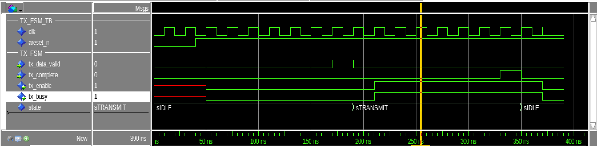

# EX4: State machine

This is the solution example for EX4 in FYS4220.

Exercise description: https://fys4220.github.io/part-exercises/exercises_state_machine.html#script-based-simulation 


## Simulation

Open Modelsim and run the following command from the sim folder:

```
do compile_and_run.do
```

Expect to see the following output in the Modelsim transcript window and the wave diagram as shown below.

```
# ** Note: Starting simulation
#    Time: 0 ns  Iteration: 0  Instance: /tx_fsm_tb
# ** Note: Enabling clock and reset
#    Time: 0 ns  Iteration: 0  Instance: /tx_fsm_tb
# ** Note: Activating state machine
#    Time: 170 ns  Iteration: 0  Instance: /tx_fsm_tb
# ** Note: Disabling clock
#    Time: 370 ns  Iteration: 2  Instance: /tx_fsm_tb
```



